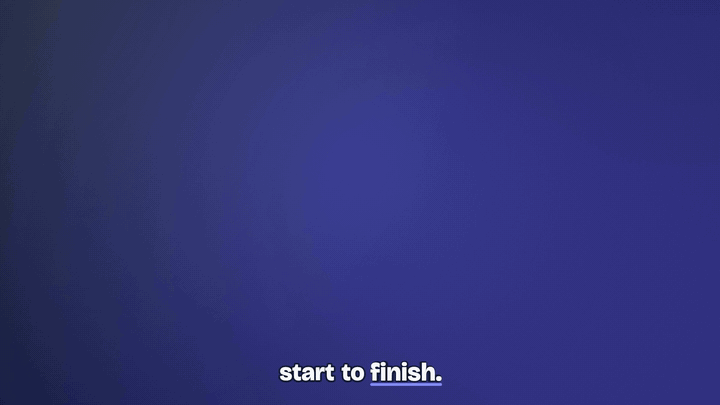

# demoloom

Turn a scripted browser flow into a polished product demo video. You write a
short Playwright script that clicks through your app; demoloom records it and
renders a finished video: a backdrop and a browser window, a smooth drawn cursor,
an auto-zoom camera that follows the action, click ripples, idle time sped up,
word-by-word captions, an optional voiceover and music, in 16:9 and 9:16. The
same inputs always give the same frames, so a demo is a file in your repo that
you re-render whenever the UI changes, not an afternoon in a video editor.



The full example with sound: [docs/preview.mp4](docs/preview.mp4).

## Install

You need Node 20+ and ffmpeg.

```
npm install --save-dev demoloom
npx playwright install chromium
brew install ffmpeg          # macOS; on Linux: apt-get install ffmpeg
```

Then run it as `npx demoloom`.

## 60-second quickstart

```
npx demoloom init my-demo                 # an example app, its flow and demoloom.json
npx demoloom record my-demo/flow.mjs      # runs the flow: raw.mp4 + events.json
npx demoloom render my-demo --stills      # 21 stills and a contact sheet, in seconds
npx demoloom render my-demo --shape=both  # my-demo/out/my-demo.mp4 and my-demo-vertical.mp4
```

Then point `url` in `flow.mjs` at your own app, script your clicks, and set the
title, beat titles and voiceover lines in `demoloom.json`. Add `--voice=say` on a
Mac for a free local voice.

## How it works

1. **Record.** `demoloom record` opens Chromium at a fixed viewport and a device
   pixel ratio of 2, runs your flow, and captures every painted frame with its
   timestamp (Chrome's screencast). Each helper call logs what happened, where
   and when to `events.json`. No real cursor is recorded; demoloom draws its own.
2. **Plan.** `demoloom render` reads the log and builds a timeline: real time
   around every action, 2 to 4x across idle stretches (page loads, waiting), a
   shot list for the camera, a path for the cursor, and voiceover cues. When a
   line of narration would run into the next step, the picture waits for it.
3. **Paint.** A headless page paints each output frame from that timeline: the
   frame of the recording at that moment, under the camera, inside the window,
   on the backdrop, with the cursor, rings, captions and cards on top.
4. **Score.** A music bed (or your track, or none), a soft click per click, a
   tick per key, the voice ducked on top, mastered to -14 LUFS.

## The flow and the record helper API

A flow is an ES module that exports `url` and `run(loom)`:

```js
// flow.mjs
export default {
  url: './app.html',                       // a file next to the flow, or any http(s) URL
  viewport: { width: 1440, height: 900 },  // optional (default 1440x900), recorded at DPR 2
  async setup(page) {},                    // optional: log in, seed data; not recorded
  async run(loom) {
    const { page } = loom;
    await loom.beat('add');
    await loom.type(page.getByPlaceholder('Add a task...'), 'Write the launch post', { label: 'task title' });
    await loom.click(page.getByRole('button', { name: 'Add task' }), { label: 'add task' });
    await loom.appear(page.getByText('Write the launch post'), { label: 'new card' });
  },
};
```

A relative `url` is served from the flow's folder on `http://localhost:4173`
(set `port` to change it), so the address is the same on every run.

Every helper takes a Playwright locator (or a CSS selector string), waits for it
to be visible, scrolls it into view if needed, moves the mouse there at a human
pace and logs the event with its box. `label` names the event in the plan and
in per-event overrides.

| helper | does |
|---|---|
| `loom.beat(id, note?)` | starts a story beat (a step in the video); closes the previous one |
| `loom.click(target, { label, hover, after })` | moves there, pauses `hover` s, clicks |
| `loom.type(target, text, { label, delay, click })` | clicks the field unless it has focus, then types at `delay` ms a key with a slight, seeded human jitter |
| `loom.select(target, { from, to, label, secs })` | drag-selects text (default: the element's first line, end to end) |
| `loom.appear(target, { label, timeout })` | waits for something to land; the camera frames it and a ring marks it |
| `loom.hover(target, { label })` | moves there without clicking |
| `loom.scroll(dy, { label, secs })` | scrolls the page smoothly |
| `loom.navigate(url, { label })` | goes to another page |
| `loom.press(key)` | presses a key (Enter, Escape, ...) |
| `loom.wait(seconds)` | waits; long waits become sped-up idle time |
| `loom.page`, `loom.now()` | the Playwright page, and seconds since the recording started |

Pacing defaults (seconds, `typeDelay` in ms) can be changed with `pace` in the
flow: `{ beforeClick: 0.3, afterClick: 0.5, typeDelay: 75, afterType: 0.4, afterAppear: 0.9, afterSelect: 0.5 }`.

### events.json

Anything that writes this file can feed `render`, not only `record`:

```json
{
  "viewport": { "width": 1440, "height": 900, "dpr": 2 },
  "url": "http://localhost:4173/app.html",
  "events": [{ "t": 1.2, "type": "click", "x": 812, "y": 440,
               "box": { "x": 760, "y": 420, "w": 104, "h": 40 }, "text": "", "label": "add task" }],
  "beats": [{ "id": "add", "t0": 0.0, "t1": 6.5, "note": "" }]
}
```

Types: `click`, `type`, `select`, `scroll`, `hover`, `navigate`, `appear`. Times
are seconds from the first frame of `raw.mp4`; positions are CSS pixels. An
`appear` with no `x`, `y` or `box` is a timing marker: real time is kept around
it and it can be a `music.turn`, but the camera and the rings ignore it unless an
`events` override gives it a `box`.
Optional: `t1` on a `type` (last key), `t0` and `from: [x, y]` on a `select`
(drag start). `render` validates the file before it starts.

## Rendering

```
demoloom render <dir> [--shape=landscape|vertical|both] [mode] [options]
```

| mode | does |
|---|---|
| (none) | the video: `<dir>/out/<dir-name>.mp4`, and `-vertical.mp4` for 9:16 |
| `--stills[=t1,t2]` | 21 stills (or those times) and a contact sheet, then the caption check |
| `--verify` | determinism check, then the caption check; exits 1 on a failure |
| `--plan` | prints the sped-up stretches, holds, VO cues, events and camera moves |
| `--poster[=t]` | one full-resolution PNG (default: on the end card) |

Options: `--out=<dir>`, `--preview=<file.mp4>` (a compressed copy under 30 MB),
`--voice=<provider>` and `--theme=<name|path>` (override the config),
`--revoice=id,id` (force those lines), `--fps=<n>`.

The caption check paints sampled frames with and without captions and fails if
anything but the backdrop sits behind a caption, or a caption leaves its band.

### Shapes

- **landscape**, 1920x1080: the window at the top, captions in a band below it,
  the steps listed down the left margin.
- **vertical**, 1080x1920: captions above the window, the current step under
  it, nothing below y 1536 (where social apps put their buttons). At rest the
  camera fits the page's height and follows the action sideways.

## Configuration: demoloom.json

Every key is optional. A full example:

```json
{
  "theme": { "extends": "default", "accent": "#22C55E",
             "endCard": { "title": "Tiny Board", "url": "board.example.com", "cta": "Try it free" } },
  "narrative": {
    "title": "Plan your week in three clicks",
    "subtitle": "A demoloom example",
    "beatTitles": { "add": "Add a task", "start": "Start it" },
    "captions": true,
    "steps": true,
    "vo": [
      { "id": "title", "at": "title", "say": "Here is a tiny board, start to finish." },
      { "id": "add", "beat": "add", "say": "Type a task, and add it to the board." },
      { "id": "outro", "at": "end", "say": "Make your own with demoloom." }
    ]
  },
  "window": { "chrome": true, "urlBar": true, "url": "board.example.com" },
  "camera": { "zoom": [1.35, 1.6], "small": 1.8, "hold": 3.0 },
  "speed": { "min": 2, "max": 4, "ranges": [{ "from": 3.0, "to": 6.0, "x": 1 }] },
  "music": { "palette": "glass", "sfx": true },
  "voice": { "provider": "none" },
  "events": { "add task": { "zoom": 1.5 }, "synced": { "zoom": false, "emphasis": true } }
}
```

### theme

A built-in name (`default`, `example-brand`), a path to a theme JSON file, or an
object; `extends` names the theme it builds on (default: `default`). Paths in a
theme file resolve next to it.

| key | meaning |
|---|---|
| `backdrop` | `{ style: gradient\|glow\|dots\|solid, from, to, glow, dots, grain }`; `dots` colours the dot grid (default: `glow`, then `accent`) |
| `accent`, `accentInk` | caption highlight, step markers, the call to action; text on accent |
| `emphasis` | rings and click ripples (default: `accent`); a lighter tint of the accent often reads better on the recording |
| `ink`, `muted`, `halo` | text on the backdrop, secondary text, the outline around captions |
| `window` | `{ bar, dots, pill, urlText, radius, shadow }`: the browser window |
| `fonts` | `{ display, ui, files: { "Family": "path.ttf" } }`; Bricolage Grotesque and DM Sans ship with demoloom, and any installed system font works by name |
| `logo` | a PNG or SVG shown on the title and end cards |
| `titleLayout` | `stack` (centred) or `left` (left aligned, with an accent rule) |
| `endCard` | `{ title, url, cta }`: the closing card (title defaults to `narrative.title`) |
| `voice` | default voice settings for every flow that uses the theme (a house narrator); the flow's own `voice` keys win |

The `default` theme is a slate to indigo gradient with a white window.
`themes/example-brand/` shows a customised brand: a warm light backdrop with a
dot grid, a coral accent, a logo and a left-aligned title.

### narrative

| key | meaning |
|---|---|
| `title`, `subtitle` | the title card |
| `beatTitles` | `{ beatId: "Shown name" }` for the step labels (default: the id, capitalised) |
| `captions` | word-by-word captions from the VO text (default `true`) |
| `steps` | the step rail (16:9) or chip (9:16) (default `true`) |
| `titleSecs` | the shortest title card, in seconds (default 2.6) |
| `vo` | the voiceover lines, below |

A VO line has an `id`, the spoken text `say`, and one place: `"at": "title"`,
`"at": "end"`, or `"beat": "<id>"` (at the beat's start, plus `offset` seconds;
or at an event with `"event": "<label>"`). Optional: `direct` (a delivery note
for the gemini voice), `caption` (display groups: `|` splits groups, and
`{spoken words=shown}` shows one token for several spoken words, such as
`{dot com=.com}`), and `file` (for the file provider).

### window

`chrome` shows the title bar, `urlBar` the address pill, and `url` sets its
text. By default the pill shows the host of the recorded page (for the example,
`localhost:4173`).

### camera

The camera is calm by default: one zoom in per beat, long holds, slow and
shallow moves, eased with a minimum-jerk curve so it never overshoots.

| key | default | meaning |
|---|---|---|
| `zoom` | `[1.35, 1.6]` | zoom range, or `{ "landscape": [..], "vertical": [..] }` |
| `small` | `1.8` | zoom for small targets (one field, one line) |
| `hold` | `3.0` | seconds a shot holds before the next move |
| `zoomSecs` | `1.2` | duration of a zoom |
| `panSecs` | `[0.8, 1.2]` | duration of a pan, by distance |
| `lead` | `1.0` | seconds the camera arrives before the action |
| `blur` | `true` | motion blur on fast moves |
| `enabled` | `true` | `false` keeps the whole page in view |

### speed

Idle stretches play at `min` to `max` times (default 2 to 4), with eased ramps.
`pad` scales the real-time margin around each action (below 1 is brisker).
`ranges: [{ from, to, x }]` (source seconds) forces a speed; `x: 1` keeps real time.

### events

Per-event overrides, keyed by label (or index): `zoom` (a number forces that
zoom, `false` keeps the camera off it), `emphasis` (`true` adds a ring, `false`
removes the one every `appear` gets), `lead` (seconds) and `box` (a tighter box
for the camera and ring). `extraEvents` adds events the log lacks; they are
checked with the same rules as `events.json`.

### music

| key | meaning |
|---|---|
| `palette` | `glass` (default), `classic`, `lofi`, `marimba`, `pulse`, `nylon`, or `none` |
| `track` | your own audio file instead of a palette, faded in and out |
| `volume` | music level multiplier (default 1) |
| `sfx` | click, key and landing sounds (default `true`) |
| `energy` | `{ beatId: 0..3 }` density per beat |
| `turn` | an event label where the music lifts |

The bed always sits about 15 dB under the voice in the speech band, whatever the
palette. The palettes are synthesized, except for CC0 piano and vibraphone
samples (see `samples/LICENSES`).

## Voiceover

Optional and pluggable. Set `voice.provider`:

| provider | what you need | settings |
|---|---|---|
| `none` (default) | nothing | captions still run, timed at a natural speaking pace |
| `file` | a WAV or MP3 per line | `file` on the line, or `<dir>/<id>.wav` in `voice.dir` (default `vo`) |
| `say` | macOS | `voice` (default `Samantha`), `rate` (words a minute, default 175) |
| `gemini` | the gcloud CLI and a Google Cloud project | `voice` (default `Sulafat`), `model`, `languageCode`, `direction`, `pace`, `project` |

Lines are re-voiced only when their text, direction or voice settings change.

**Gemini setup.** demoloom uses your own gcloud login; no keys go in the repo.

```
gcloud auth login
gcloud config set project YOUR_PROJECT       # or "project" under "voice"
gcloud services enable texttospeech.googleapis.com
```

At render time demoloom runs `gcloud auth print-access-token` and calls the
Cloud Text-to-Speech API with the Gemini TTS model. `direction` is a style
prompt for the whole video; `direct` on a line adds to it. The default
direction is a calm, unhurried product-demo narrator whose lines settle on a
falling finish; keep per-line notes soft too ("easy and relaxed" works better
than "urgent" or "punchy").

**Caption timing.** If [faster-whisper](https://github.com/SYSTRAN/faster-whisper)
is installed (`pip install faster-whisper`), demoloom transcribes each line to get
the time of every word, and prints any word the voice said differently from the
script. Without it, words are spread evenly over the line, weighted by length
with a pause after punctuation: close enough for most lines. Set
`DEMOLOOM_PYTHON` to the Python that has faster-whisper, and `voice.align` to
`even` or `whisper` to force one.

## Determinism

Every frame is a pure function of its time: the planner is plain arithmetic, the
camera and cursor are closed-form curves, randomness is seeded, and the page
keeps no state between frames. Render frame 412 alone, or the frames in reverse,
and you get the same pixels. That is what makes demos reviewable and cheap to
redo: change a beat title, re-render, and only that changes.

`demoloom render <dir> --verify` hashes 24 frames forward, in reverse and
again, and fails if any differ. `npm test` checks the camera, cursor, time map
and captions the same way, without a browser. The recording itself is real
browser time, so record once and render as often as you like.

## How it compares

[Screen Studio](https://screen.studio) and
[OpenScreen](https://github.com/siddharthvaddem/openscreen) are GUI editors: you
record your screen by hand, then tune zooms and cuts in a timeline. They are
great for one-off videos and for anything that is not a web page. demoloom is
scripted: the flow, the narration and the look are text files, the recording is
repeatable, and the render is deterministic, so a demo can live in your repo and
be re-rendered in CI when the UI changes. It only records what Chromium can
show, and it has no timeline editor; you change the output by changing the
config.

## Credits

The camera and cursor ideas owe a lot to OpenScreen (ideas only, no code; see
[THIRD_PARTY.md](THIRD_PARTY.md)). Fonts: Bricolage Grotesque and DM Sans (SIL
OFL). Samples: VCSL by Versilian Studios (CC0). Built on Playwright and ffmpeg.

## License

MIT, see [LICENSE](LICENSE).

## Releasing

Bump `version` in `package.json` in a PR and merge it. Then publish a GitHub release tagged `v<version>` (for example `gh release create v0.1.1 --generate-notes`). The `publish` workflow tests and publishes to npm through npm trusted publishing, so no token or OTP is needed.
